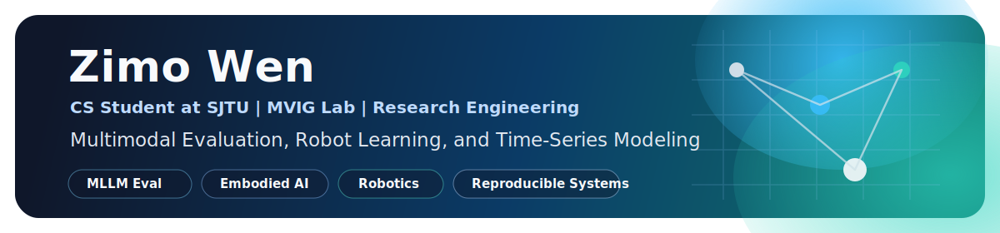

  

  
  

  I build research prototypes and practical tooling around large multimodal models,
  robot learning, and data-centric evaluation.
   
  I care about clean experiments, reproducible systems, and practical open-source work.

  
  
  
  

## About Me

- Computer Science student at Shanghai Jiao Tong University.
- Member of MVIG Lab, with current interests in multimodal evaluation, embodied AI, robotics, and time-series modeling.
- Most comfortable with Python, PyTorch, C++, Git, Linux, and lightweight engineering workflows.
- Outside the lab: ping pong and computer games.

## Current Focus

<table>
  <tr>
    <td width="33%" valign="top">
      <strong>Multimodal Evaluation</strong> 
      Building benchmark workflows, model integrations, and Visual CoT style evaluation
      pipelines for large multimodal models.
    </td>
    <td width="33%" valign="top">
      <strong>Robot Learning</strong> 
      Exploring grasp detection, manipulation-oriented perception, and research tooling
      that connects model outputs with physical constraints.
    </td>
    <td width="33%" valign="top">
      <strong>Structured Prediction</strong> 
      Working on retrieval-inspired ideas for few-shot time-series forecasting and
      other data-efficient learning problems.
    </td>
  </tr>
</table>

## Featured Work

| Project | What it is |
| --- | --- |
| [UniG2U](https://github.com/nssmd/UniG2U) | Extends `lmms-eval` with additional benchmarks, model integrations, Visual CoT pipelines, and one-shot scripts for large multimodal model evaluation. |
| [DANet-CIKM2024](https://github.com/nssmd/DANet-CIKM2024) | A RAG-inspired dual-attention model for few-shot time series prediction, combining long-term and short-term pattern retrieval. |
| [robotgrasp](https://github.com/nssmd/robotgrasp) | Physics-informed dexterous grasp detection with attention-driven force-closure analysis for robotic manipulation. |
| [lmms-eval](https://github.com/nssmd/lmms-eval) | Engineering work around one-click evaluation workflows for large multimodal models across text, image, video, and audio tasks. |

## Toolbox

  
  
  
  
  
  
  
  
  
  

## Open to Collaborate

I am happy to talk about multimodal benchmarks, research engineering, robotics perception, and interesting open-source collaborations.
