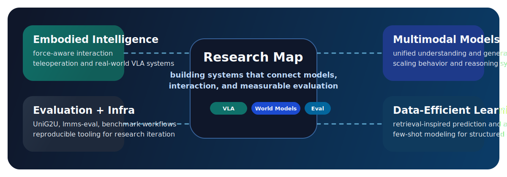

  

  
  
  

  

  Undergraduate researcher at Shanghai Jiao Tong University working on embodied intelligence,
  multimodal models, world-model-adjacent systems, and open-source research infrastructure.

  
  
  
  
  

## Highlights

  
  
  
  
  

## Research Map

  

## Building Now

<table>
  <tr>
    <td width="33%" valign="top">
      <strong>Embodied Systems</strong> 
      Wearable gripper fingertips, force-aware sensing, teleoperation pipelines, and
      VLA-style model training for real-world manipulation.
    </td>
    <td width="33%" valign="top">
      <strong>Multimodal Evaluation</strong> 
      Benchmarks and tooling around unified multimodal models, generation-for-understanding,
      and practical evaluation workflows.
    </td>
    <td width="33%" valign="top">
      <strong>Generative Modeling</strong> 
      Scaling behavior, multimodal generation, video-related systems, and research
      infrastructure that supports clean iteration.
    </td>
  </tr>
</table>

## Selected Publications

| Work | Signal |
| --- | --- |
| [UniG2U: Benchmarking When Generation Helps Understanding in Multimodal Unified Models](https://nssmd.github.io/unig2u.github.io/) | arXiv, HuggingFace Daily Papers Top `#1` |
| [DANet: A RAG-inspired Dual Attention Model for Few-shot Time Series Prediction](https://github.com/nssmd/DANet-CIKM2024) | CIKM 2025, Oral |
| Tri-MARF: A Tri-Modal Multi-Agent Responsive Framework for Comprehensive 3D Object Annotation | NeurIPS 2025, Poster |
| VL-R1-X: Incentivizing Diverse Multimodal Reasoning via Cross-modality Guidance | ICML 2026, Under Review |
| StepRouter: From Effort Priors to Utility Posteriors | ICML 2026, Under Review |

## Featured Repositories

<table>
  <tr>
    <td width="50%" valign="top">
      <strong><a href="https://github.com/nssmd/UniG2U">UniG2U</a></strong> 
      Benchmark and evaluation suite for studying when generation improves understanding
      in multimodal unified models.
    </td>
    <td width="50%" valign="top">
      <strong><a href="https://github.com/nssmd/robotgrasp">robotgrasp</a></strong> 
      Physics-informed dexterous grasp detection with force-closure analysis for
      robotic manipulation.
    </td>
  </tr>
  <tr>
    <td width="50%" valign="top">
      <strong><a href="https://github.com/nssmd/DANet-CIKM2024">DANet-CIKM2024</a></strong> 
      Official code for a retrieval-inspired few-shot time-series forecasting model.
    </td>
    <td width="50%" valign="top">
      <strong><a href="https://github.com/nssmd/lmms-eval">lmms-eval</a></strong> 
      Engineering work around one-click evaluation for large multimodal models across
      text, image, video, and audio tasks.
    </td>
  </tr>
</table>

## Toolbox

  
  
  
  
  
  
  
  
  
  
  
  

  
<strong>Background</strong>

   

  <ul>
    <li>B.Eng. in Computer Science and Technology at Shanghai Jiao Tong University, Zhiyuan Honors Program.</li>
    <li>Current: Undergraduate Research Intern at MVIG Lab, advised by Prof. Cewu Lu.</li>
    <li>Previously worked with Microsoft Research Asia, Collaborative Intelligence Technology Lab at SJTU, and Wen's Lab at North Carolina State University.</li>
    <li>Honors include SJTU Outstanding Student Award, Zhiyuan Honors Scholarship, SJTU Excellence Scholarship, and Meng Minwei International Exchange Fund.</li>
  </ul>

## Open to Collaborate

I am happy to talk about embodied intelligence, multimodal evaluation, open-source research tooling, and interesting collaboration opportunities.
